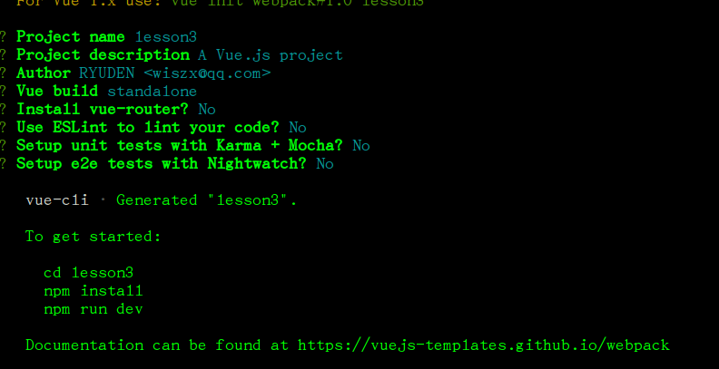

# lesson-3 webpack环境下 开发


## webpack模块化开发/打包

当需要构建大型项目的时候，配合使用webpack或/Browserfiy进行模块化开发并且打包。
vue.js 提供了配套工具来开发单独的文件组件。*.vue文件为vuejs的组件文件。
Vue文件将 html标签，JavaScript脚本和css样式文件组合写在一起，构成一个文件组件。

例如：

```

<template>

	<!-- html标签，只能存在一个div容器。表示这个是一个vue组件。 -->
</templage>	
<script type="text/ecmascript-6">
	// 这里写组件会使用到的代码，ecmascript-6申明我们会用到ES6的一些写法
</script>
<style type="text/css" scoped>
		/*写css代码。scoped声明 此部分css样式只在本组件当中生效。*/
</style>

```

## 配置 webpack开发环境。


vuejs提供了一个拿来即可使用的模板构建工具。配合NPM安装使用。

1. 安装node.js ..
   推荐使用淘宝的npm镜像。国内访问速度是非常快的。现在更新到8.0版本了，所以就找到8.0版本相应的安装包安装一个。


2. 跟着淘宝npm镜像上面的 cnpm安装教程，为node.js添加 cnpm命令.


3. 准备好node,打开nodejs的控制台.开始使用vue提供的工具初始化一个vue项目的模板.

4. 在控制台中 运行	  cnpm install vue 安装vuejs

5. 运行 cnpm install vue-cli -g  安装 vue提供的一个模板搭建工具.. 其中 -g 是npm的一个全局安装命令.初次安装之后,再次构建项目的时候就不需要再安装模板工具了

安装完成之后   输入 vue -V 可以查看vue当前的版本.


安装vue-cli工具之后便使用 vue init webpack project  创建一个基于webpack的vue新项目, project为自己给项目取的名字.

 继续运行 命令  cd  project 定位到 刚才创建的项目.

运行 cnpm install  从网络上下载安装 项目需要使用的依赖等.

安装完成之后  运行  npm run dev 就可以运行项目. 打开  localhost:8080便可以看到了整个环境.

此时,vuejs的webpack环境安装成功,可以在之前项目文件夹当中进行开发..


## 项目分析


```
.
|-- build                            // 项目构建/打包相关代码
|   |-- build.js                     // 生产环境构建代码
|   |-- check-version.js             // 检查 node、npm 等版本
|   |-- dev-client.js                // 热重载相关
|   |-- dev-server.js                // 构建本地服务器
|   |-- vue-loader.conf.js           // 解析 *.vue类型文件的配置文件 
|   |-- utils.js                     // 构建工具相关
|   |-- webpack.base.conf.js         // webpack 基础配置（出入口和 loader）
|   |-- webpack.dev.conf.js          // webpack 开发环境配置
|   |-- webpack.prod.conf.js         // webpack 生产环境配置
|-- config                           // 项目开发环境配置
|   |-- dev.env.js                   // 开发环境变量
|   |-- index.js                     // 项目一些配置变量（开发环境接口转发将在此配置）
|   |-- prod.env.js                  // 生产环境变量
|   |-- test.env.js                  // 测试环境变量
|-- node_modeles                     // 项目需要的一些打包好的插件,依赖.
|-- src                              // 源码目录
|   |-- components                   // vue组件公共组件
|   |-- App.vue                      // 页面入口文件
|   |-- main.js                      // 程序入口文件，加载各种公共组件
|-- static                           // 静态文件，比如一些图片，json数据等
|-- test                             // 自动化测试相关文件
|-- .babelrc                         // ES6语法编译配置
|-- .editorconfig                    // 定义代码格式
|-- .eslintignore                    // ESLint 检查忽略的文件
|-- .eslistrc.js                     // ESLint 文件，如需更改规则则在此文件添加
|-- .gitignore                       // git 上传需要忽略的文件
|-- README.md                        // 项目说明
|-- index.html                       // 入口页面
|-- package.json                     // 项目基本信息 保存某些依赖关系
.
```


我们开发的源码储存在 src目录下 一般的开发就在  src目录下进行,如果需要对项目进行调试的话可以更改其他的一些配置文件.
